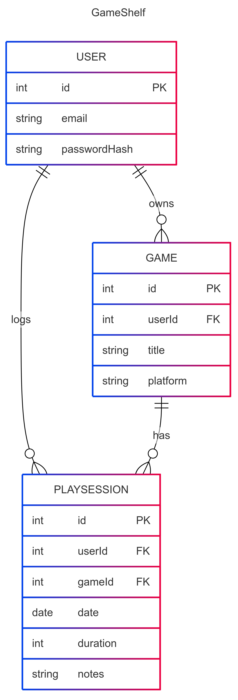

# Game Library Tracker

## 1. Description
Game Library Tracker is a lightweight MVC web app for gamers to catalog their PC/console/mobile titles and record play sessions. Each user can:

- **Build** a personal library of games (title, platform).  
- **Log** each play session with date, duration, and quick notes.  
- **Review** their play history per game to see when and how long they’ve played.  

This app solves the “lost‑track” problem: gamers often forget which games they own, how far they got, or what strategies they tried. By centralizing your game list and session notes, you get clear visibility into your play habits and progress.

---

## 2. Requirements

### User Stories

#### Authentication & User Management
- As a user, I want to **register** for an account so my data stays private.  
- As a user, I want to **log in** and **log out** so only I can see and edit my library.

#### Game Library
- As a user, I want to **add** a new game (title, platform, cover URL) to my library.  
- As a user, I want to **view** all games in a list, showing title and platform.  
- As a user, I want to **edit** or **delete** a game entry if I’ve made a mistake.

#### Play Sessions
- As a user, I want to **log a play session** for a game (date, duration in minutes, notes).  
- As a user, I want to **see all sessions** for a given game in chronological order.  
- As a user, I want to **edit** or **delete** a session entry if I mistyped.

---
## 3. Entity Relationships

---
## 4. API Routes
| Request                              | Action                                 | Response                          | Description                                               |
|--------------------------------------|----------------------------------------|-----------------------------------|-----------------------------------------------------------|
| **GET** `/register`                  | `AuthController.showRegisterForm`      | `200` + `auth/register` view      | Show the user registration form.                          |
| **POST** `/register`                 | `AuthController.register`              | `302 → /games`                    | Create a new user, start session, redirect to game list.  |
| **GET** `/login`                     | `AuthController.showLoginForm`         | `200` + `auth/login` view         | Show the login form.                                      |
| **POST** `/login`                    | `AuthController.login`                 | `302 → /games`                    | Authenticate credentials, start session, redirect.        |
| **POST** `/logout`                   | `AuthController.logout`                | `302 → /login`                    | End session, redirect to login.                           |
| **GET** `/games`                     | `GameController.index`                 | `200` + `games/index` view        | List all games in the user’s library.                     |
| **GET** `/games/new`                 | `GameController.new`                   | `200` + `games/new` view          | Show the “add new game” form.                             |
| **POST** `/games`                    | `GameController.create`                | `302 → /games/:id`                | Create a game entry, redirect to its detail page.         |
| **GET** `/games/:id`                 | `GameController.show`                  | `200` + `games/show` view         | Show details for one game and its play sessions.          |
| **GET** `/games/:id/edit`            | `GameController.edit`                  | `200` + `games/edit` view         | Show the “edit game” form.                                |
| **POST** `/games/:id`                | `GameController.update`                | `302 → /games/:id`                | Update game metadata, redirect back to its detail page.   |
| **POST** `/games/:id/delete`         | `GameController.delete`                | `302 → /games`                    | Delete the game (and associated sessions), redirect list. |
| **GET** `/games/:gameId/sessions/new`| `SessionController.new`                | `200` + `sessions/new` view       | Show the form to log a new play session for a game.       |
| **POST** `/games/:gameId/sessions`   | `SessionController.create`             | `302 → /games/:gameId`            | Create a play session, redirect to game’s detail page.    |
| **GET** `/sessions/:id/edit`         | `SessionController.edit`               | `200` + `sessions/edit` view      | Show the form to edit an existing play session.           |
| **POST** `/sessions/:id`             | `SessionController.update`             | `302 → /games/:gameId`            | Update a session entry, redirect to its game’s detail.    |
| **POST** `/sessions/:id/delete`      | `SessionController.delete`             | `302 → /games/:gameId`            | Delete a session entry, redirect back to game’s detail.   |
---
## 5. Wireframes
---
## Possible Implementations (if time permits)
- Cover Images for games (added as a string url to the games table)

